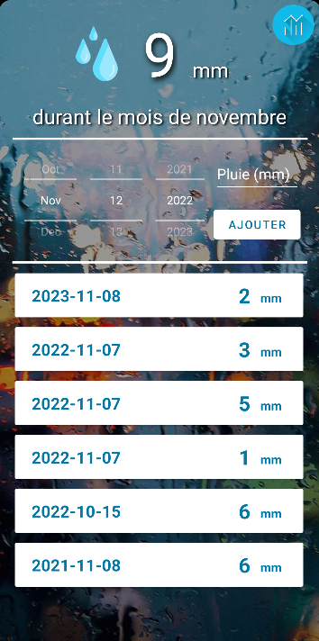
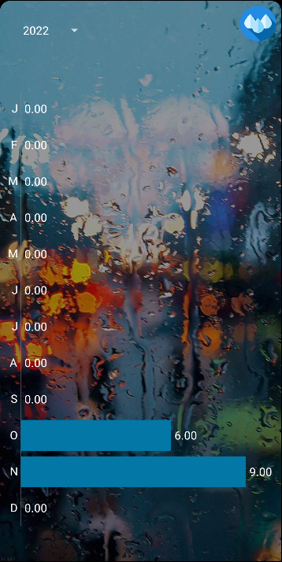

# Rain gauge app
 Simplistic application allowing to save rain records. If you want to try, APK is in ```app/debug``` (require android 5.0 (API level 21) or newer). If you find bugs, please create a GitHub issue so I can fix it. Any contribution is also welcome. The current app language is French.
<br><br>

<br><br>
For the moment it is not planned to deploy this application on the Google Play Store because it was created mainly for personal use.

## Why ?
Recently I saw my father taking rain readings in a small notebook. When I opened the notebook I saw a large number of records. As a data scientist, it seemed a shame not to use all this data.<br>
So I thought it would be interesting to create an application (under android because that's what my father and I use) to save all this data but also to have some info on this data like the average rain value per month. Moreover it would allow to save the rain records in a more secure way.<br><br>
**Why not use a pre-made application ?**<br><br> 
First, it's the perfect opportunity to learn the basics of android application development. Secondly, most of the applications didn't have the features I was looking for, by creating my own application I can implement exactly the features I want.

## How ?
This application has been developed under android studio. It is currently a mix between kotlin and java (according to the tutorials I find on the internet) however it is planned that the application will be only under kotlin when my knowledge of the language will allow me to translate all the java files into kotlin. The app is first tested with the Google Pixel phone emulator in android studio and then I test it with my phone (Samsung 20 FE 5G).

## Current features/bug and upcoming features
| Current Features | Bugs | Upcoming Features |
| :-------------- |:----|:-----------------|
| <ul><li>Saving of rainfall data</li><li>Swipe to delete data</li></ul> | <ul><li>If you enter a value and then click add on the keypad, if you then click on the add button, the view is not updated.</li></ul> | <ul><li>Sort value by date</li><li>Display the current month under the total rainfall value</li><li>Graph showing total rainfall value for the last 12 month</li></ul> |